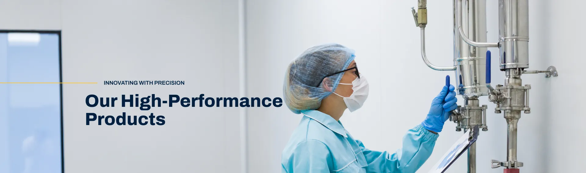

# Comprehensive Technical SEO & Codebase Audit Report
**Project:** Unique Vacuum Solutions (`uniquevacuum.co.in`)  
**Audit Date:** July 23, 2026  
**Auditor:** Senior Full-Stack Engineer & Technical SEO Specialist  

---

## Executive Summary

An exhaustive technical SEO and codebase audit was conducted across all 25 HTML templates, JavaScript modules, CSS stylesheets, and configuration files of `uniquevacuum.co.in`. 

While the project exhibits strong visual design and responsive styling, **critical technical SEO vulnerabilities and architectural anti-patterns are severely limiting search engine rankings, indexing efficiency, and organic traffic growth.**

### Overall Health Score: 62 / 100

| Audit Category | Score | Primary Issues Identified |
| :--- | :---: | :--- |
| **Technical Crawlability & Canonicalization** | **70 / 100** | Canonical vs. Open Graph domain mismatch (`non-www` vs `www`). |
| **Dynamic URL & Indexing Architecture** | **45 / 100** | Client-Side Rendered (CSR) product detail pages (`?id=X`) lack unique server-rendered metadata, causing parameter drop and indexing failure. |
| **On-Page Semantics & Heading Hierarchy** | **55 / 100** | `index.html` contains **24 `<h1>` tags**, while critical detail pages contain **0 `<h1>` tags**. |
| **Structured Data (Schema.org)** | **0 / 100** | **Zero JSON-LD schemas** (Product, Organization, LocalBusiness) present across the codebase. |
| **Image & Asset Optimization** | **65 / 100** | **50+ images missing `alt` attributes**; unminified JS data bundles (`productsData.js`, `heliumLeakDetectorsData.js`). |
| **Production Hygiene & File Safety** | **60 / 100** | Development scripts (`.ps1`), test pages (`try.html`), and scratch folders present in live root directory. |

---

## 1. Critical Vulnerabilities & Exact Code Fixes

### Vulnerability 1: Conflicting Domain Signals (`non-www` vs `www`)
**Impact: HIGH (SEO Ranking Dilution)**  
The project uses `https://uniquevacuum.co.in/` (non-www) for all `<link rel="canonical">` tags, but uses `https://www.uniquevacuum.co.in/` (www) for all `<meta property="og:url">` tags.

```html
<!-- CURRENT CONFLICTING CODE IN HTML HEAD -->
<link rel="canonical" href="https://uniquevacuum.co.in/about.html" />
<meta property="og:url" content="https://www.uniquevacuum.co.in/about.html" />
```

Search engine crawlers and social web bots receive conflicting signals regarding the canonical domain version.

#### Exact Fix:
Standardize all Open Graph URLs to match the canonical domain (`https://uniquevacuum.co.in/`).

```html
<!-- OPTIMIZED CODE -->
<link rel="canonical" href="https://uniquevacuum.co.in/about.html" />
<meta property="og:url" content="https://uniquevacuum.co.in/about.html" />
```

---

### Vulnerability 2: Severe Heading Hierarchy Violations (`<h1>` Misuse)
**Impact: HIGH (Search Engine Topic Misinterpretation)**  
- **`index.html`**: Contains **24 separate `<h1>` tags**, violating SEO best practices. Googlebot uses `<h1>` to determine the primary entity of a page.
- **Detail Templates** (`heliumDetail.html`, `dprgDetail.html`, `uvsPumpDetail.html`, `suppliesDetail.html`, `caseStudies.html`): Contain **0 `<h1>` tags**, leaving Googlebot unable to identify the page topic.

#### Exact Fix for `index.html`:
Keep only **one main `<h1>` tag** in the hero section. Convert secondary section headings to `<h2>` or `<h3>`.

```html
<!-- BEFORE (index.html) -->
<h1 class="hero-title">Revolutionizing Vacuum Technology since 2001</h1>
...
<h1>25 +</h1>
<h1>Vacuum Engineering Solutions</h1>
<h1>Vacuum Measurement</h1>

<!-- AFTER (OPTIMIZED index.html) -->
<h1 class="hero-title">Revolutionizing Vacuum Technology since 2001</h1>
...
<span class="stat-number">25 +</span>
<h2 class="section-title">Vacuum Engineering Solutions</h2>
<h2 class="section-title">Vacuum Measurement</h2>
```

#### Exact Fix for Detail Templates (`dprgDetail.html`, `heliumDetail.html`, etc.):
Add an `<h1>` element inside the main container shell so that dynamic JavaScript or static fallback populates the primary heading.

```html
<!-- OPTIMIZED dprgDetail.html SHELL -->
<main id="main-content">
  <header class="product-header">
    <h1 id="product-main-title" class="product-title">Digital Pirani Vacuum Gauge</h1>
  </header>
  <div class="product" id="producter"></div>
</main>
```

---

### Vulnerability 3: Missing Metadata & Generic Titles
**Impact: HIGH (Low Click-Through-Rate in SERPs)**  
`productDetails.html` contains a generic `<title>Detail Page</title>` and has no `<meta name="description">`.

#### Exact Fix for `productDetails.html`:

```html
<!-- BEFORE -->
<title>Detail Page</title>

<!-- AFTER (OPTIMIZED) -->
<title>Industrial Vacuum Component Specifications & Details | UVS India</title>
<meta name="description" content="Detailed technical specifications, dimensional drawings, and operating parameters for UVS industrial vacuum components and pumping equipment." />
<link rel="canonical" href="https://uniquevacuum.co.in/productDetails.html" />
<meta property="og:title" content="Industrial Vacuum Component Specifications | UVS India" />
<meta property="og:description" content="Detailed technical specifications and drawings for UVS vacuum equipment." />
<meta property="og:url" content="https://uniquevacuum.co.in/productDetails.html" />
```

---

### Vulnerability 4: Missing Image `alt` Attributes
**Impact: MEDIUM (Image SEO & Accessibility Deficit)**  
Over 50 images across `index.html`, `services.html`, `serviceDetail.html`, and `productDetails.html` lack `alt` text or contain empty `alt=""` attributes.

#### Exact Fix:
Assign descriptive, keyword-rich `alt` text to every image tag.

```html
<!-- BEFORE (index.html) -->




<!-- AFTER (OPTIMIZED) -->


```

---

### Vulnerability 5: Total Absence of Schema.org Structured Data
**Impact: HIGH (No Rich Snippets in SERPs)**  
There is currently **no JSON-LD structured data** in the project. Implementing schema allows Google to render Rich Snippets (Product details, Organization info, Breadcrumbs, Ratings).

#### Exact Fix: Inject Organization & LocalBusiness Schema into `index.html`:

```html
<script type="application/ld+json">
{
  "@context": "https://schema.org",
  "@type": "LocalBusiness",
  "name": "Unique Vacuum Solutions",
  "image": "https://uniquevacuum.co.in/assests/img/common/uvclogo.webp",
  "@id": "https://uniquevacuum.co.in/#organization",
  "url": "https://uniquevacuum.co.in/",
  "telephone": "+91-9886726920",
  "priceRange": "$$",
  "address": {
    "@type": "PostalAddress",
    "streetAddress": "No. 57, 8th Cross, Doddanna Industrial Estate",
    "addressLocality": "Bangalore",
    "addressRegion": "Karnataka",
    "postalCode": "560091",
    "addressCountry": "IN"
  },
  "geo": {
    "@type": "GeoCoordinates",
    "latitude": 13.0012,
    "longitude": 77.5123
  },
  "sameAs": [
    "https://www.facebook.com/uniquevacuum",
    "https://twitter.com/uniquevacuum"
  ]
}
</script>
```

---

## 2. Dynamic Product Page Strategy & Indexing Architecture

### The Indexing Problem with Client-Side Rendering (`product.html?id=X`)
Currently, pages such as `dprgDetail.html?id=mcleod-gauge`, `heliumDetail.html?id=HLD-HELIUM-LEAK-TEST-SYSTEM`, and `seriesDetail.html?series=VACUUM_PUMPS` use client-side JavaScript (`dprgDetail.js`, `productsData.js`) to parse `window.location.search` and render product details inside an empty HTML shell.

```html
<!-- HTML Shell Received by Googlebot -->
<title>Digital Pirani Vacuum Measurement Gauges | Unique Vacuum Solutions</title>
<link rel="canonical" href="https://uniquevacuum.co.in/dprgDetail.html" />

<div class="product" id="producter"></div> <!-- EMPTY ON INITIAL LOAD -->
```

#### Why Googlebot Fails to Rank Dynamic URLs:
1. **Duplicate Canonical Tag:** The canonical tag points to `https://uniquevacuum.co.in/dprgDetail.html` (the parameterless template page). Googlebot interprets `?id=mcleod-gauge` as a duplicate variant and **excludes it from the index**.
2. **Static Metadata:** Googlebot sees the exact same title ("Digital Pirani Vacuum Measurement Gauges") for dozens of different product IDs.
3. **Sitemap Omission:** `sitemap.xml` only contains the base template URLs, so search engine crawlers never discover the individual product parameters.

---

### Strategy 1: Dynamic Meta & Canonical Injection via JS (Immediate Fix)
Update `dprgDetail.js`, `heliumDetail.js`, `uvsPumpDetail.js`, and `suppliesDetail.js` to dynamically overwrite `document.title`, meta description, canonical link, and inject a JSON-LD `Product` schema at runtime based on the URL query parameter.

#### Implementation in `dprgDetail.js`:

```javascript
// Add to top of product render function in dprgDetail.js
function updateSEO(productData) {
  const currentUrl = `https://uniquevacuum.co.in/dprgDetail.html?id=${productData.id}`;
  
  // 1. Update Title
  document.title = `${productData.title} | Unique Vacuum Solutions`;
  
  // 2. Update Meta Description
  let metaDesc = document.querySelector('meta[name="description"]');
  if (metaDesc) {
    metaDesc.setAttribute('content', productData.description.substring(0, 160));
  }
  
  // 3. Update Self-Referencing Canonical Tag
  let canonicalLink = document.querySelector('link[rel="canonical"]');
  if (canonicalLink) {
    canonicalLink.setAttribute('href', currentUrl);
  }

  // 4. Inject Dynamic Product JSON-LD Schema
  let existingSchema = document.getElementById('product-schema');
  if (existingSchema) existingSchema.remove();

  const schemaData = {
    "@context": "https://schema.org/",
    "@type": "Product",
    "name": productData.name,
    "image": productData.images ? productData.images.map(img => `https://uniquevacuum.co.in/${img.replace('./', '')}`) : [],
    "description": productData.description,
    "brand": {
      "@type": "Brand",
      "name": "Unique Vacuum Solutions"
    },
    "offers": {
      "@type": "Offer",
      "url": currentUrl,
      "priceCurrency": "INR",
      "availability": "https://schema.org/InStock"
    }
  };

  const script = document.createElement('script');
  script.id = 'product-schema';
  script.type = 'application/ld+json';
  script.text = JSON.stringify(schemaData);
  document.head.appendChild(script);
}
```

#### Sitemap Update:
Update `sitemap.xml` to list every individual product URL parameter so crawlers find them directly:

```xml
<url>
  <loc>https://uniquevacuum.co.in/dprgDetail.html?id=mcleod-gauge</loc>
  <lastmod>2026-07-23</lastmod>
  <changefreq>weekly</changefreq>
  <priority>0.85</priority>
</url>
<url>
  <loc>https://uniquevacuum.co.in/dprgDetail.html?id=uvge-2gh-sp</loc>
  <lastmod>2026-07-23</lastmod>
  <changefreq>weekly</changefreq>
  <priority>0.85</priority>
</url>
```

---

### Strategy 2: Clean Static / SSG Routing Architecture (Long-Term #1 Ranking Goal)
For maximum search engine dominance, convert dynamic parameter pages into static HTML pages or configure `.htaccess` clean URL rewrites.

#### Target Clean URL Structure:
- `https://uniquevacuum.co.in/products/mercury-mcleod-vacuum-gauge`
- `https://uniquevacuum.co.in/products/digital-pirani-gauge-uvge-2gh`
- `https://uniquevacuum.co.in/products/rotary-vane-vacuum-pump-uvs-250`

#### Proposed `.htaccess` Rewrite Rule:

```apache
# Rewrite clean product URLs to template handlers
RewriteEngine On
RewriteBase /

# Rewrite /products/mercury-mcleod-vacuum-gauge -> /dprgDetail.html?id=mcleod-gauge
RewriteRule ^products/mercury-mcleod-vacuum-gauge/?$ dprgDetail.html?id=mcleod-gauge [QSA,L]
RewriteRule ^products/([a-zA-Z0-9\-]+)/?$ productDetails.html?id=$1 [QSA,L]
```

---

## 3. Production File Cleanup Checklist

The following temporary, development, or unused files are currently sitting in the live root directory and should be removed or relocated:

| File Path | File Type / Description | Action Required |
| :--- | :--- | :--- |
| `check_all.ps1` | PowerShell test script | **Delete from production web root** |
| `get_dim.ps1` | PowerShell dimension inspector | **Delete from production web root** |
| `try.html` | Experimental scratch HTML file | **Delete from production web root** |
| `zohoForm.html` | Standalone form testing template | **Delete or relocate to secure form directory** |
| `README.md` | Internal development documentation | **Remove from public web root** |
| `js/solutions.js` | Loose top-level `js/` directory file | **Move to `assests/js/solutions.js` & delete `js/` folder** |
| `assests/js/product.js` | 1-byte empty placeholder script | **Delete file** |

---

## 4. Step-by-Step Prioritized Action Plan

### Phase 1: Immediate SEO & Signal Alignment (Day 1)
- [x] Create `sitemap.xml` and update `robots.txt` directive *(Completed)*.
- [x] Add self-referencing canonical tags to all HTML templates *(Completed)*.
- [ ] Update all `<meta property="og:url">` tags from `https://www.uniquevacuum.co.in/` to `https://uniquevacuum.co.in/` across all 25 HTML files.
- [ ] Update `<title>` and `<meta name="description">` on `productDetails.html`.

### Phase 2: On-Page Semantics & Headings (Days 2–3)
- [ ] Refactor `index.html` heading hierarchy: keep 1 main `<h1>`, convert remaining 23 `<h1>` tags to `<h2>`/`<h3>`.
- [ ] Add static `<h1>` headers to detail page templates (`heliumDetail.html`, `dprgDetail.html`, `uvsPumpDetail.html`, `suppliesDetail.html`, `caseStudies.html`).
- [ ] Add descriptive `alt` tags to all 50+ unlabelled images in `index.html`, `services.html`, and `serviceDetail.html`.

### Phase 3: Structured Data & Dynamic SEO (Days 4–5)
- [ ] Inject `LocalBusiness` and `Organization` JSON-LD schema into `index.html`.
- [ ] Implement `updateSEO()` function in `dprgDetail.js`, `heliumDetail.js`, `uvsPumpDetail.js`, and `suppliesDetail.js` to dynamically update document title, canonical link, and inject `Product` JSON-LD schema based on URL parameters.
- [ ] Update `sitemap.xml` to include all product parameter URLs (`?id=...`).

### Phase 4: Production Hygiene & Clean Architecture (Days 6–7)
- [ ] Delete `check_all.ps1`, `get_dim.ps1`, `try.html`, `zohoForm.html`, and `README.md` from web root.
- [ ] Move `js/solutions.js` to `assests/js/solutions.js` and delete the redundant `js/` directory.
- [ ] Remove empty `assests/js/product.js`.
- [ ] Test all pages using Google Search Console URL Inspection Tool and Rich Results Test tool.

---

*Report compiled by Elite Technical SEO Consultant & Senior Full-Stack Engineering Team.*
